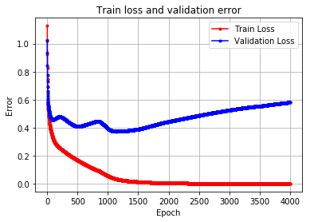
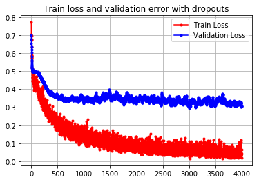

# Projekt KWD

Jakub Pranica
Robert Trojan

Identyfikacja choroby Parkinsona na podstawie mowy (Parkinson’s Data Set) - Neural network for binary classficiation

Zbudowaliśmy sieć neuronową z 5 warstwami mającymi różne funkcje aktywacji. Model wytrenowaliśmy i zwizualizowaliśmy wyniki w sposób przedstawiony poniżej. 

## Opis zestawu danych: Parkinsons Disease

__Oxford Parkinson's Disease Detection Dataset__

This dataset is composed of a range of biomedical voice measurements from 
31 people, 23 with Parkinson's disease (PD). Each column in the table is a 
particular voice measure, and each row corresponds one of 195 voice 
recording from these individuals ("name" column). The main aim of the data 
is to discriminate healthy people from those with PD, according to "status" 
column which is set to 0 for healthy and 1 for PD.

The data is in ASCII CSV format. The rows of the CSV file contain an 
instance corresponding to one voice recording. There are around six 
recordings per patient, the name of the patient is identified in the first 
column.For further information or to pass on comments, please contact Max 
Little (littlem '@' robots.ox.ac.uk).

Attribute Information:

Matrix column entries (attributes):
- name - ASCII subject name and recording number
- MDVP:Fo(Hz) - Average vocal fundamental frequency
- MDVP:Fhi(Hz) - Maximum vocal fundamental frequency
- MDVP:Flo(Hz) - Minimum vocal fundamental frequency
- MDVP:Jitter(%),MDVP:Jitter(Abs),MDVP:RAP,MDVP:PPQ,Jitter:DDP - Several 
measures of variation in fundamental frequency
- MDVP:Shimmer,MDVP:Shimmer(dB),Shimmer:APQ3,Shimmer:APQ5,MDVP:APQ,Shimmer:DDA - Several measures of variation in amplitude
- NHR,HNR - Two measures of ratio of noise to tonal components in the voice
- status - Health status of the subject (one) - Parkinson's, (zero) - healthy
- RPDE,D2 - Two nonlinear dynamical complexity measures
- DFA - Signal fractal scaling exponent
- spread1,spread2,PPE - Three nonlinear measures of fundamental frequency variation 

dataset: https://archive.ics.uci.edu/ml/machine-learning-databases/parkinsons/parkinsons.data

#### Importy


```python
import numpy as np
import pandas as pd
import matplotlib.pyplot as plt

from sklearn.model_selection import train_test_split
from sklearn.preprocessing import StandardScaler
from sklearn.metrics import confusion_matrix, accuracy_score

from keras.layers import Dropout

#set seed for reproduction purpose
from numpy.random import seed
seed(1) 

from tensorflow import set_random_seed
set_random_seed(2)

import random as rn
rn.seed(12345)

import tensorflow as tf
tf.set_random_seed(1234)

#import seaborn as sns
```

#### Wczytanie i standaryzacja danych


```python
url = "https://archive.ics.uci.edu/ml/machine-learning-databases/parkinsons/parkinsons.data"

names = ["name","MDVP:Fo(Hz)","MDVP:Fhi(Hz)","MDVP:Flo(Hz)","MDVP:Jitter(%)","MDVP:Jitter(Abs)","MDVP:RAP","MDVP:PPQ",
         "Jitter:DDP","MDVP:Shimmer","MDVP:Shimmer(dB)","Shimmer:APQ3","Shimmer:APQ5","MDVP:APQ","Shimmer:DDA",
         "NHR","HNR","status","RPDE","DFA","spread1","spread2","D2","PPE"]

parkinson_df = pd.read_csv(url, names=names) #load CVS data

#load Pandas Dataframe into numpy arrays
data = parkinson_df.loc[1:,["MDVP:Fo(Hz)","MDVP:Fhi(Hz)","MDVP:Flo(Hz)","MDVP:Jitter(%)","MDVP:Jitter(Abs)","MDVP:RAP","MDVP:PPQ",
         "Jitter:DDP","MDVP:Shimmer","MDVP:Shimmer(dB)","Shimmer:APQ3","Shimmer:APQ5","MDVP:APQ","Shimmer:DDA",
         "NHR","HNR","RPDE","DFA","spread1","spread2","D2","PPE"]].values.astype(np.float)
target = parkinson_df.loc[1:, ['status']].values.astype(np.float)

#standarise data
data = StandardScaler().fit_transform(data)

data_train, data_test, target_train, target_test = \
train_test_split(data, target, test_size=0.3, random_state=545)
```

#### Budowa sieci neuronowej za pomocą Kerasa - Model sekwencyjny


```python
from keras.models import Sequential
from keras.layers import Dense
from keras.optimizers import SGD
neural_model = Sequential([
    Dense(16, input_shape=(22,), activation="relu"),
    Dense(8, activation="exponential"),
    Dense(4, activation='tanh'),
    Dense(2, activation='linear'),
    Dense(1, activation="sigmoid")
])

#show summary of a model
neural_model.summary()
```

    _________________________________________________________________
    Layer (type)                 Output Shape              Param #   
    =================================================================
    dense_88 (Dense)             (None, 16)                368       
    _________________________________________________________________
    dense_89 (Dense)             (None, 8)                 136       
    _________________________________________________________________
    dense_90 (Dense)             (None, 4)                 36        
    _________________________________________________________________
    dense_91 (Dense)             (None, 2)                 10        
    _________________________________________________________________
    dense_92 (Dense)             (None, 1)                 3         
    =================================================================
    Total params: 553
    Trainable params: 553
    Non-trainable params: 0
    _________________________________________________________________
    

#### Trenowanie modelu


```python
neural_model.compile(SGD(lr = .003), "binary_crossentropy", \
                     metrics=["accuracy"])

np.random.seed(0)
run_hist_1 = neural_model.fit(data_train, target_train, epochs=4000,\
                              validation_data=(data_test, target_test), \
                              verbose=False, shuffle=False)

print("Training neural network...\n")

print('Accuracy over training data is ', \
      accuracy_score(target_train, neural_model.predict_classes(data_train)))

print('Accuracy over testing data is ', \
      accuracy_score(target_test, neural_model.predict_classes(data_test)))

conf_matrix = confusion_matrix(target_test, neural_model.predict_classes(data_test))
print(conf_matrix)
```

    Training neural network...
    
    Accuracy over training data is  1.0
    Accuracy over testing data is  0.8813559322033898
    [[10  5]
     [ 2 42]]
    

#### Wizualizacja procesu uczenia


```python
#run_hist_1.history.keys()

plt.plot(run_hist_1.history["loss"],'r', marker='.', label="Train Loss")
plt.plot(run_hist_1.history["val_loss"],'b', marker='.', label="Validation Loss")
plt.title("Train loss and validation error")
plt.legend()
plt.xlabel('Epoch'), plt.ylabel('Error')
plt.grid()
```





Można zauważyć przyuczenie do danych uczących. Dodaliśmy więc warstwy Dropout, co pozwoliło uzyskać lepsze wyniki dla zestawu walidacyjnego.

### Budowa modelu z Dropoutami


```python
#model with dropouts

neural_network_d = Sequential()
neural_network_d.add(Dense(16, activation='relu', input_shape=(22,)))
neural_network_d.add(Dense(8, activation="exponential"))
neural_network_d.add(Dropout(0.1))
neural_network_d.add(Dense(4, activation='tanh'))
neural_network_d.add(Dense(2, activation='linear'))
neural_network_d.add(Dropout(0.1))
neural_network_d.add(Dense(1, activation='sigmoid'))

neural_network_d.summary()
```

    _________________________________________________________________
    Layer (type)                 Output Shape              Param #   
    =================================================================
    dense_98 (Dense)             (None, 16)                368       
    _________________________________________________________________
    dense_99 (Dense)             (None, 8)                 136       
    _________________________________________________________________
    dropout_28 (Dropout)         (None, 8)                 0         
    _________________________________________________________________
    dense_100 (Dense)            (None, 4)                 36        
    _________________________________________________________________
    dense_101 (Dense)            (None, 2)                 10        
    _________________________________________________________________
    dropout_29 (Dropout)         (None, 2)                 0         
    _________________________________________________________________
    dense_102 (Dense)            (None, 1)                 3         
    =================================================================
    Total params: 553
    Trainable params: 553
    Non-trainable params: 0
    _________________________________________________________________
    


```python
neural_network_d.compile(SGD(lr = .003), "binary_crossentropy", metrics=["accuracy"])

run_hist_2 = neural_network_d.fit(data_train, target_train, epochs=4000, \
                                  validation_data=(data_test, target_test), \
                                  verbose=False, shuffle=False)

print("Training neural network w dropouts..\n")

print('Accuracy over training data is ', accuracy_score(target_train, \
                                                        neural_network_d.predict_classes(data_train)))

print('Accuracy over testing data is ', accuracy_score(target_test, \
                                                       neural_network_d.predict_classes(data_test)))


```

    Training neural network w dropouts..
    
    Accuracy over training data is  0.9926470588235294
    Accuracy over testing data is  0.9322033898305084
    


```python
plt.plot(run_hist_2.history["loss"],'r', marker='.', label="Train Loss")
plt.plot(run_hist_2.history["val_loss"],'b', marker='.', label="Validation Loss")
plt.title("Train loss and validation error with dropouts")
plt.legend()
plt.grid()
```





Dropouty pomagają uniknąć zbyt dużego przyuczenia do danych.
